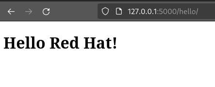
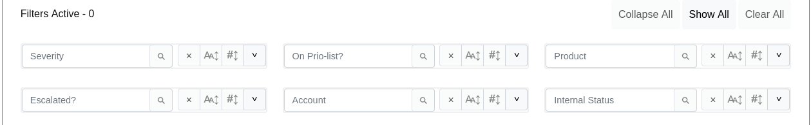
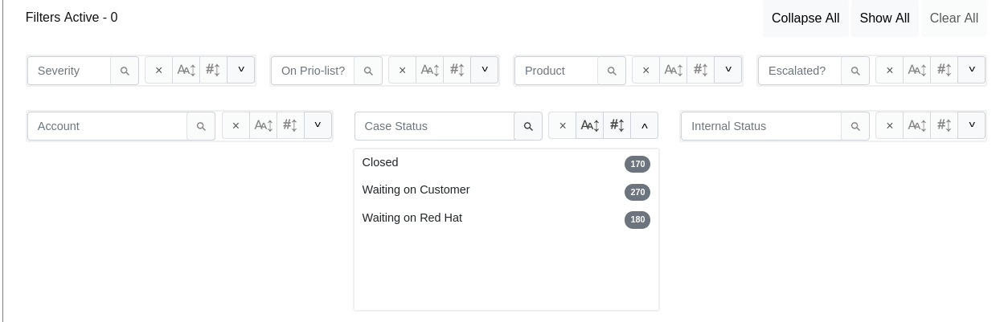

## Pre-Commit

We have a `.pre-commit-config.yaml` file in our repository that will help you avoid common linting/formatting mistakes when you commit your changes. You can get set up by following
pre-commit's [quick start guide](https://pre-commit.com/#quick-start).

## Some Common Ways to Contribute

### Add a new page

The official Flask documentation contains a useful [walkthrough](https://flask.palletsprojects.com/en/3.0.x/quickstart/#rendering-templates) of how to add/modify a new web view.

In general, you need to:

- Create a template
- Gather/set up data
- Create an endpoint
- Render the template

For example (slightly altered from the Flask docs mentioned above):

1. Create your Jinja template:

    ```{jinja}
    <!doctype html>
    <title>Hello from Flask</title>
     
    <h1>Hello {{ account }}!</h1>
    
    <h1>Hello, Customer!</h1>
    
    ```

2. Create an endpoint, set up data, and render the template w/ your data:

    ```{python}
    from flask import Flask, render_template
    # Create a Flask app: 
    # https://flask.palletsprojects.com/en/3.0.x/quickstart/#a-minimal-application
    app = Flask(__name__)

    @app.route('/hello/') # Create Endpoint '/hello/': https://flask.palletsprojects.com/en/3.0.x/quickstart/#routing
    def hello():
        # Set up data
        account = "Red Hat"

        # Render template and pass in our data
        return render_template('hello.html', account=account)
    ```

You will be able to see your page by running your Flask server and visiting `<URL>/hello/`:


Our templates are contained within `dashboard/src/t5gweb/templates` and our endpoints are
defined in `dashboard/src/t5gweb/ui.py`.

### Alter JavaScript

We are using a framework called [DataTables](https://datatables.net/) to add interactive tables to our dashboard. The majority of our JavaScript is related to these tables:

- `dashboard/src/t5gweb/static/js/table.js` contains some configuration for our tables + some related JavaScript (ex: updating the URL of the page to match the displayed table)
- `dashboard/src/t5gweb/static/js/stats.js` contains the table configuration for our stats page, since tables have different layouts there.
- Most changes to these pages will probably be in the configuration of the data table.

For example, here's how to add a new search pane for the "Case Status" column to the table page, as described in the datatables [documentation](https://datatables.net/extensions/searchpanes/):


1. Find the configuration of the search panes in `table.js`:

    ```{javascript}
        searchPanes: {
        order: [
            "Severity",
            "On Prio-list?",
            "Product",
            "Escalated?",
            "Account",
            "Internal Status",
        ],
        columns: [2, 3, 7, 8, 10],
        initCollapsed: true,
    ```

2. Case Status is column 9, so let's make the appropriate changes:

    ```{javascript}
        searchPanes: {
        order: [
            "Severity",
            "On Prio-list?",
            "Product",
            "Escalated?",
            "Account",
            "Case Status",
            "Internal Status"
        ],
        columns: [2, 3, 7, 8, 9, 10],
    ...
    ```

And that's it, we can now filter our table by "Case Status":



The DataTables [documentation](https://datatables.net) is very extensive, and can help you find and make any other changes that you might think of.

### Adding tests

We use [pytest](https://docs.pytest.org/en/8.0.x/) for our unit tests. Pytest's docs are very helpful, but here's a simple example to get started:

1. You need to import the function(s) you are interested in testing.
2. Within your test, you should follow the "Arrange -> Act -> Assert" workflow (explanation [here](https://docs.pytest.org/en/8.0.x/explanation/anatomy.html))

For example:

```{python}
# utils.py
def addition(x, y):
    return x+y
```

```{python}
# tests/test_addition.py
import utils

def test_addition():
    # Arrange
    x = 5
    y = 2

    # Act
    sum = utils.addition(x,y)

    # Assert
    assert sum == 7
```

If this test fails, we know that our `addition()` function isn't doing what we desire,
and there is a bug somewhere in our code. This will help us catch bugs before they are deployed to production. It also helps when you make a change, to know at a glance that your code isn't breaking anything else.

Unit tests should be able to run in isolation, without contacting any external services, like APIs or databases. A unit test is meant to test only our code, and shouldn't be affected by things like state or internet connection, which can fluctuate and result in unreliable unit tests.

This is different than an integration test or end-to-end test, which might include testing whether your code can create a card on an instance of Jira.

As a result, when testing functions that require an external connection, you should "mock" all of these connections. A mock can stand-in for a call to an API/DB in your test. More info is available [here](https://microsoft.github.io/code-with-engineering-playbook/automated-testing/unit-testing/mocking/#mocks).

We use the [pytest-mock](https://pytest-mock.readthedocs.io/en/latest/) package, which is a thin-wrapper around the [mock](https://docs.python.org/dev/library/unittest.mock.html#quick-guide) package provided by Python's standard library.

For example:

```{python}
# utils.py
import requests

def get_data_from_external_service():
    response = requests.get("https://api.example.com/data")
    value = response.json()["value"]

    return value + 2
```

```{python}
# tests/test_utils.py
import pytest
import utils

def test_get_data_from_external_service(mocker):
    # Arrange
    expected_value = 41

    # Mocking the 'requests.get' method with a MagicMock
    mock_response = mocker.MagicMock()
    mock_response.json.return_value = {"value": expected_value}
    mocker.patch('utils.requests.get', return_value=mock_response)

    # Act
    result = get_data_from_external_service()

    # Assert
    assert result == expected_value + 2
```

In this case, the API call will not take place, and will instead be represented by our mock object. This abstracts away the API itself, and we are free to test our code and our code only (i.e. that we are adding 2 to the API response value.)

Our unit tests are located in `tests/`, and we run tests automatically for PR's and commits on the `main` branch via GitHub Actions (`.github/workflows/linter.yml`). You can run tests locally by installing pytest and pytest-mock, and then running `pytest` from the root directory of the repository (`t5g-field-support-team-utils/`).

### Add a new scheduled task

We use [Celery beat](https://docs.celeryq.dev/en/stable/userguide/periodic-tasks.html) to run our scheduled tasks, which gather data from various APIs and combine it into what is visible on our dashboard.

Here's a simple example of how you can add a new scheduled task:

in `dashboard/src/t5gweb/taskmgr.py`, add a new function with the appropriate fixture:

```{python}
@mgr.task  # Fixture
def print_message():
    print("Testing scheduled tasks.")
```

Then, in setup_scheduled_tasks(), add the function as a task:

```{python}
def setup_scheduled_tasks(sender, **kwargs):
    sender.add_periodic_task(
        crontab(hour="*", minute="*/15"),  # every 15 minutes
        print_message.s()
        name="print_message",
    )
```

Now, the message will be printed every 15 minutes.
